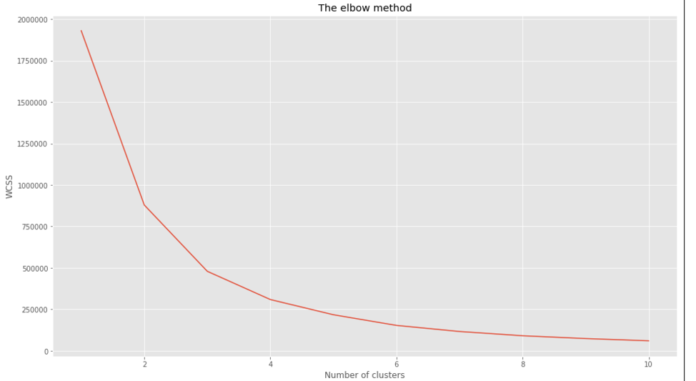
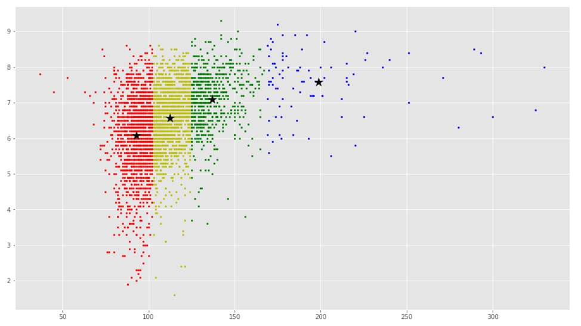

## Dataset 
IMDB Movie Dataset. This dataset is generated from IMDb data. The dataset is released under Open Database License and has rights to use granted under some conditions. The dataset is enriched with various details of 5000 different language movies and can be used for practical business scenarios. 
  The link of the dataset is here - (https://www.kaggle.com/carolzhangdc/imdb-5000-movie-dataset).

## Objective 
Categorize movies based on the movie duration and identify how movies length can affect the ratings.

## Algorithm 
### K-Means Clustering 
  1. Downloaded the csv file of the dataset and use pandas to read the csv into dataframe.
  2. Prepare the data for example, dealing with the rows of the dataset which are null or has 0 as values.
  3. The columns used for analysis here are ‘duration’, which says how long the movie is and ‘imdb_score’, which depicts the high rated movies. A numpy array is created based on values of these two columns. 
  4. This array is used for kmeans.fit. Used scikit learn to identify optimal number of clusters using elbow method. Tried values of k as 4, 5;
  

  	Fig 1: The elbow method 
    
found the optimal value of k as 4
  5. Identified the clusters and centroid and plotted them using matplotlib. 
  
  

   	Fig 2: K-means clusters

 kmeans-movies-data.py code is also submitted.

## Conclusion 
We found 4 clusters in the data set corresponding to 4 categories of movie durations. The red dots shows movies which are less than 100 minutes, followed by yellow dots which are between approx 2 hours. The green dots shows movies which are around 150 minutes and blue dots are long duration movies.  As per the above cluster formation, we also see that longer duration movies are usually high rated.

